multiTEMPTED Vignette
================

<!-- README.md is generated from README.Rmd. Please edit that file -->

## Development setup (Docker)

If working in a Docker container, run the following:

``` zsh
# emulates amd64 if working on non-linux and builds container
docker build . --platform=linux/amd64 -t multi.tempted

# ports to 8787 for rocker container
docker run \
  --platform=linux/amd64 \
  -v $(pwd):/home/rstudio/work \
  -e PASSWORD=123 \
  -p 8787:8787 \
  multi.tempted
```

Then in the containerized RStudio session:

1.  USER: rstudio, PS: 123
2.  Open File \> Open Project and select `multi.tempted.Rproj`
3.  Once opened, run:

``` r
setwd('~/work')
library(devtools)
library(testthat)
library(roxygen2)
library(knitr)
library(rmarkdown)
```

------------------------------------------------------------------------

## Introduction of multiTEMPTED

`multi.tempted` extends TEMPTED (TEMPoral TEnsor Decomposition) to
several longitudinal modalities at once, jointly decomposing M subject ×
feature × time tensors into:

- **A** (subjects × r) — shared subject scores; the thread tying the
  modalities together.
- **B_m** (features × r) — per-modality feature loadings.
- **Zeta_m** — per-modality smooth temporal curves.
- **Lambda** (M × r) — per-modality magnitude of each component.

Modalities may differ in their features, feature counts, and sampling
times.

**Citations:** TEMPTED, the single-modality precursor ([Shi et
al.](https://doi.org/10.1101/2023.07.26.550749)); and the underlying
theory ([Han et al.](https://doi.org/10.1080/01621459.2022.2153689)).

------------------------------------------------------------------------

## Installation

You can install the development version of `multi.tempted` from
[GitHub](https://github.com/loulind/multi.tempted) with:

``` r
# install.packages("pak")
pak::pak("loulind/multi.tempted")
```

------------------------------------------------------------------------

## Load packages for this vignette

``` r
library(tidyverse)
library(corrplot)
library(plotly)
library(igraph)
library(ggraph)
library(tidygraph)
library(patchwork)
library(magick)
library(pheatmap)
library(np)

library(devtools)
load_all()
```

------------------------------------------------------------------------

## Read the example data

The [iPOP exercise study](https://med.stanford.edu/snyderlab/ipop.html):
four omic modalities (**cytokine**, **metabolome**, **lipid**,
**protein**), each on a log₁₀ scale, measured at five visits. `ipop`
also carries subject metadata (`meta_subj`) and per-sample `SubjectID` /
`timepoint` (`meta_visit`).

``` r
ipop <- multi.tempted::ipop

names(ipop)
#> [1] "meta_subj"  "meta_visit" "cytokine"   "metabolome" "lipid"     
#> [6] "protein"
# [1] "meta_subj" "meta_visit" "cytokine" "metabolome" "lipid" "protein"
```

``` r
# Stack the four modality tables into a named list
featuretables <- lapply(3:6, function(m) as.matrix(ipop[[m]]))
names(featuretables) <- names(ipop)[3:6]
M <- length(featuretables)

# Map visit codes to approximate minutes from baseline
timepoint <- as.vector(ipop[[2]]$timepoint)
timepoint <- case_when(
  timepoint == 1 ~ 0,
  timepoint == 2 ~ 12,
  timepoint == 3 ~ 25,
  timepoint == 4 ~ 40,
  timepoint == 5 ~ 70
)
timepoints <- rep(list(timepoint), M)
subjectID  <- rep(list(as.character(ipop[[2]]$SubjectID)), M)

# Grouping: a per-sample sex vector, and a subjectID--sex table
group_sex   <- ipop[[1]]$Sex
group_subID <- ipop[[1]][, c("subjectID", "Sex")]
```

------------------------------------------------------------------------

## Running multiTEMPTED

### Run multiTEMPTED

`multitempted_all()` runs the whole pipeline; see `?multitempted_all`
for every argument. The decisions that matter most:

- `transforms`: `"clr"` for raw microbiome counts, `"none"` for
  already-scaled data.
- `r`: number of components. `centralize`: remove each modality’s mean
  structure first (default `TRUE`).
- `do_ratio`: log-ratio meta-features — `TRUE` only for raw counts.
- `weights`: down-weight a dominant modality when scales differ (see
  note below).

> **Signs** of A, B, and Zeta can flip together, exactly as in SVD —
> read relative patterns, not absolute sign.

> **Scale:** the shared A pools least-squares signal, so a larger-scale
> modality pulls harder. These modalities share a log₁₀ scale, so equal
> weights are fine; otherwise standardise first or set `weights` ∝ 1 /
> modality variance.

``` r
output <- multitempted_all(
  featuretables = featuretables,
  timepoints    = timepoints,
  subjectID     = subjectID,
  transforms    = "none", # data are already log10-transformed
  do_ratio      = FALSE,  # not raw counts
  r             = 3 # number computed components (will compute more later)
)
#> Estimating component 1 of 3
#>   Converged: dif = 7.06e-05 after 52 iterations
#> Estimating component 2 of 3
#>   Converged: dif = 7.98e-05 after 20 iterations
#> Estimating component 3 of 3
#>   Converged: dif = 9.71e-05 after 80 iterations
names(output)
#>  [1] "datlists"              "mean_svd"              "A_hat"                
#>  [4] "B_hat"                 "Zeta_hat"              "time_Zeta"            
#>  [7] "Lambda"                "r_square"              "accum_r_square"       
#> [10] "metafeature_aggregate" "toppct_aggregate"      "contrast"
```

------------------------------------------------------------------------

### Low-dimensional representation of subjects

`A_hat` is the joint score matrix: each row places one subject in the
shared r-dimensional space. Read it like PCA scores.

``` r
plot_subject_loading(output$A_hat, group = group_subID)
```

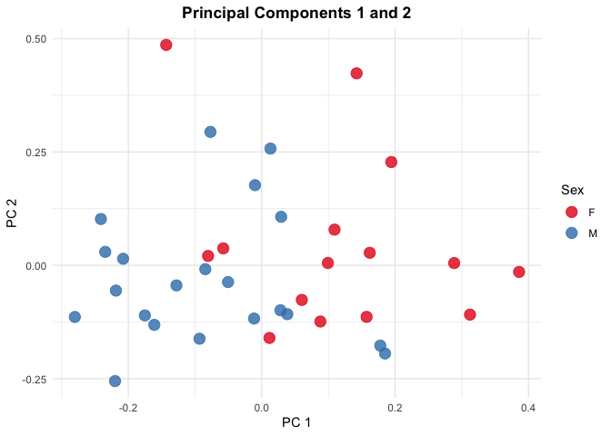

------------------------------------------------------------------------

### Plot the temporal loading functions

`Zeta_m` shows when each component is active within a modality: a peak
marks the time where that component’s signal is strongest.

``` r
plot_time_loading(output) +
  labs(x = "Minutes from baseline", title = "Temporal loadings by modality")
```

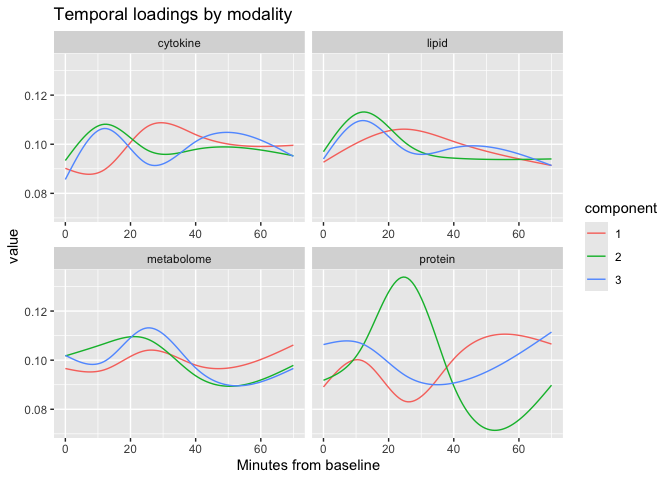

------------------------------------------------------------------------

### Plot the feature loadings

Feature loadings rank each modality’s features by their contribution to
a component. Below: top 1% by absolute loading, negative in red,
positive in blue.

``` r
plots_feat <- plot_feature_loading(output, pct = 0.01)

# display one modality at a time:
plots_feat$cytokine
```

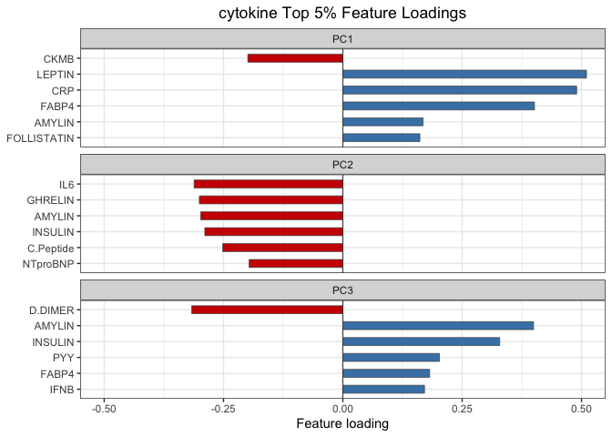

``` r
plots_feat$metabolome
```

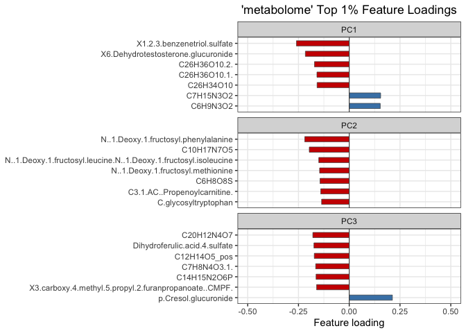

``` r
plots_feat$lipid
```

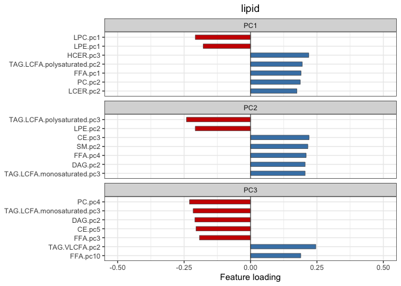

``` r
plots_feat$protein
```

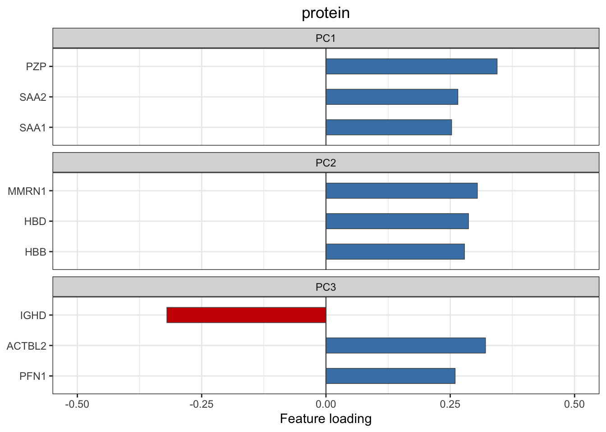

------------------------------------------------------------------------

### Trajectories of individual features

Use the loading rankings to pick features worth inspecting directly.
Here, two top cytokines (GLP-1, Insulin) smoothed over time and split by
sex.

``` r
feat_mat <- ipop[["cytokine"]][, c("GLP1", "INSULIN")]

plot_feature_summary(
  feature_mat = feat_mat,
  time_vec    = timepoints[[1]],
  group_vec   = group_sex,
  bws         = 10
) + labs(x = "Minutes from baseline")
```

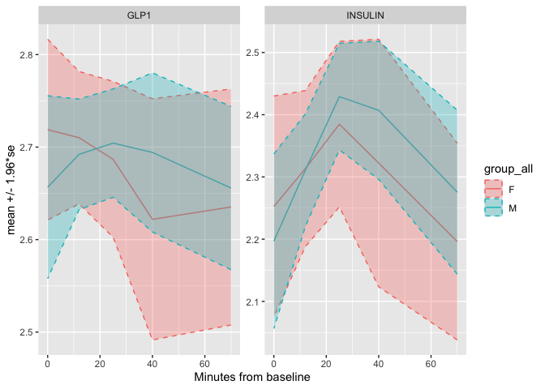

------------------------------------------------------------------------

### Subject trajectories (meta-features)

Loadings act as weights to collapse a modality into one “meta-feature”
trajectory per subject and component — handy for group comparisons.
`metafeature_aggregate` uses observed data; `_est` uses the de-noised
fit.

``` r
# returns a named list of ggplots, one per modality
traj_plots <- plot_metafeature(output$metafeature_aggregate, group = group_subID)

# display one modality:
traj_plots$cytokine + labs(x = "Minutes from baseline")
```

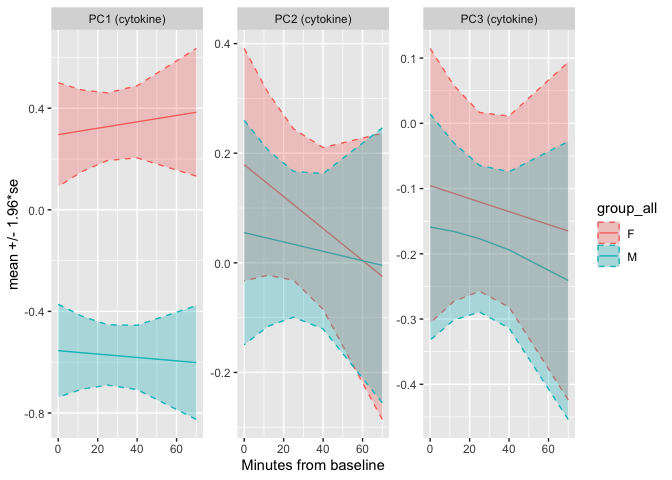

------------------------------------------------------------------------

### Modality loading correlations

Features with similar loading profiles co-respond. Kendall correlations
between loading vectors expose these modules — we refit with more
components (`r` = 10) for a richer profile.

``` r
output2 <- multitempted_all(
  featuretables = featuretables,
  timepoints    = timepoints,
  subjectID     = subjectID,
  transforms    = "none", # data are already log10-transformed
  do_ratio      = FALSE,  # not raw counts
  r             = 10  # computing more components to compute correlations
)
#> Estimating component 1 of 10
#>   Converged: dif = 7.06e-05 after 52 iterations
#> Estimating component 2 of 10
#>   Converged: dif = 7.98e-05 after 20 iterations
#> Estimating component 3 of 10
#>   Converged: dif = 9.71e-05 after 80 iterations
#> Estimating component 4 of 10
#>   Converged: dif = 9.14e-05 after 36 iterations
#> Estimating component 5 of 10
#>   Converged: dif = 7.55e-05 after 22 iterations
#> Estimating component 6 of 10
#>   Converged: dif = 8.84e-05 after 27 iterations
#> Estimating component 7 of 10
#>   Converged: dif = 6.73e-05 after 18 iterations
#> Estimating component 8 of 10
#>   Converged: dif = 7.42e-05 after 59 iterations
#> Estimating component 9 of 10
#>   Converged: dif = 7.90e-05 after 32 iterations
#> Estimating component 10 of 10
#>   Converged: dif = 7.99e-05 after 36 iterations
```

``` r
# extract feature loadings per modality (transpose to r x p for cor())
cyto_loadings  <- t(as.matrix(output2$B_hat[["cytokine"]]))
metab_loadings <- t(as.matrix(output2$B_hat[["metabolome"]]))
lipid_loadings <- t(as.matrix(output2$B_hat[["lipid"]]))
prot_loadings  <- t(as.matrix(output2$B_hat[["protein"]]))

# within-modality feature correlation matrices
cyto_corr_mat  <- cor(cyto_loadings,  method = "kendall")
metab_corr_mat <- cor(metab_loadings, method = "kendall")
lipid_corr_mat <- cor(lipid_loadings, method = "kendall")
prot_corr_mat  <- cor(prot_loadings,  method = "kendall")

corrplot(cyto_corr_mat,  method = "color", type = "lower", tl.cex = 0.2, order = "hclust")
```

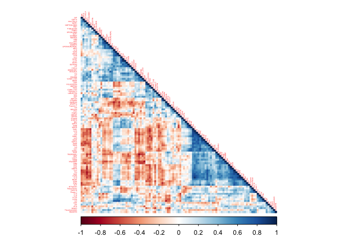

``` r
corrplot(metab_corr_mat, method = "color", type = "lower", tl.cex = 0.2, order = "hclust")
```

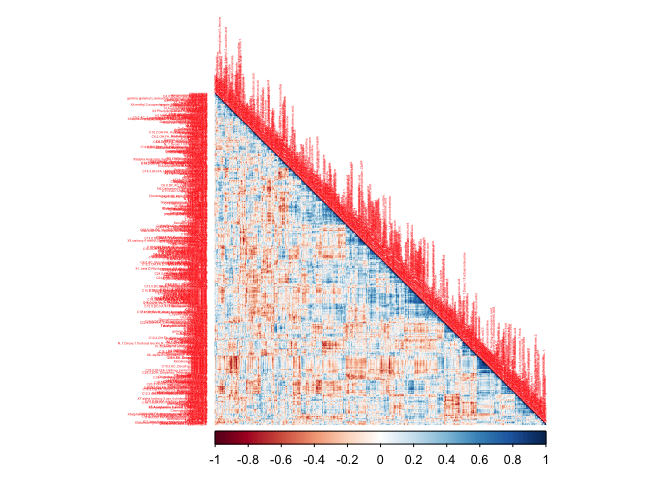

``` r
corrplot(lipid_corr_mat, method = "color", type = "lower", tl.cex = 0.2, order = "hclust")
```

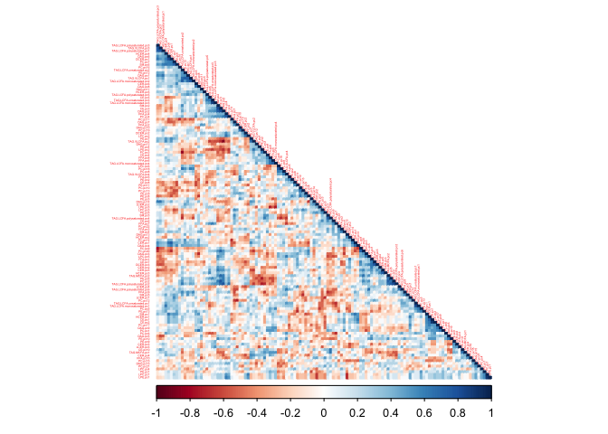

``` r
corrplot(prot_corr_mat,  method = "color", type = "lower", tl.cex = 0.2, order = "hclust")
```

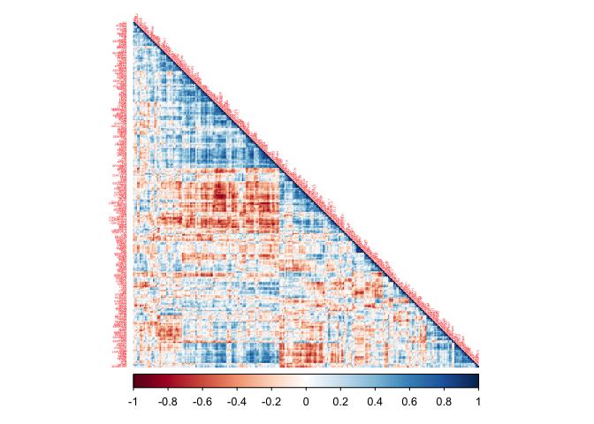

Cross-modality correlations surface features from different modalities
driven by the same components (rectangular ordered heatmaps via
`pheatmap`).

``` r
cyto_v_metab <- cor(cyto_loadings, metab_loadings, method = "kendall")
cyto_v_lipid <- cor(cyto_loadings, lipid_loadings, method = "kendall")
cyto_v_prot  <- cor(cyto_loadings, prot_loadings,  method = "kendall")
metab_v_lipid <- cor(metab_loadings, lipid_loadings, method = "kendall")
metab_v_prot  <- cor(metab_loadings, prot_loadings,  method = "kendall")
lipid_v_prot  <- cor(lipid_loadings, prot_loadings,  method = "kendall")

pheatmap(cyto_v_metab,
         clustering_method = "complete",
         color = colorRampPalette(c("red", "white", "blue"))(50),
         main = "Cytokine vs Metabolome Correlation Heatmap",
         fontsize_row = 5,
         fontsize_col = 1)
```

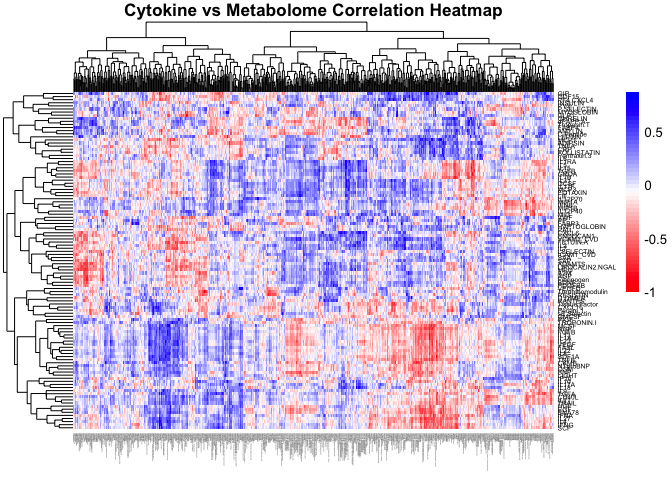

``` r
pheatmap(cyto_v_lipid,
         clustering_method = "complete",
         color = colorRampPalette(c("red", "white", "blue"))(50),
         main = "Cytokine vs Lipid Correlation Heatmap",
         fontsize_row = 5,
         fontsize_col = 4)
```

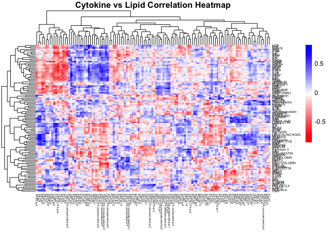

``` r
pheatmap(cyto_v_prot,
         clustering_method = "complete",
         color = colorRampPalette(c("red", "white", "blue"))(50),
         main = "Cytokine vs Protein Correlation Heatmap",
         fontsize_row = 5,
         fontsize_col = 4)
```

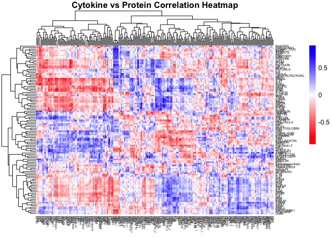

``` r
pheatmap(metab_v_lipid,
         clustering_method = "complete",
         color = colorRampPalette(c("red", "white", "blue"))(50),
         main = "Metabolome vs Lipid Correlation Heatmap",
         fontsize_row = 1,
         fontsize_col = 4)
```

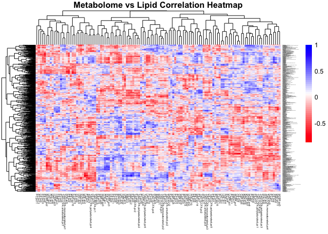

``` r
pheatmap(metab_v_prot,
         clustering_method = "complete",
         color = colorRampPalette(c("red", "white", "blue"))(50),
         main = "Metabolome vs Protein Correlation Heatmap",
         fontsize_row = 1,
         fontsize_col = 4)
```

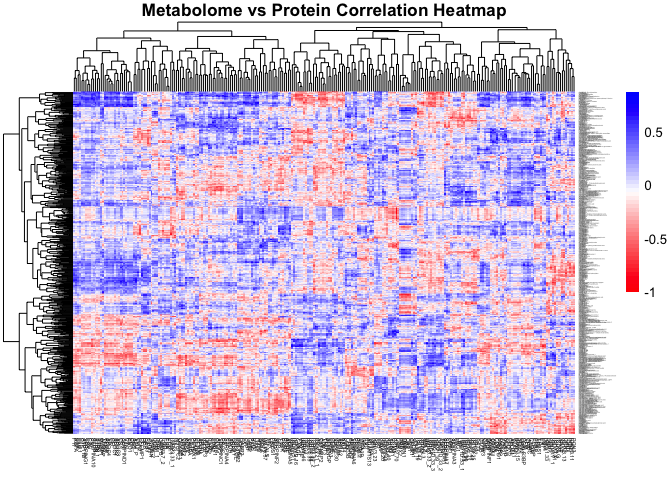

``` r
pheatmap(lipid_v_prot,
         clustering_method = "complete",
         color = colorRampPalette(c("red", "white", "blue"))(50),
         main = "Lipid vs Protein Correlation Heatmap",
         fontsize_row = 5,
         fontsize_col = 2)
```

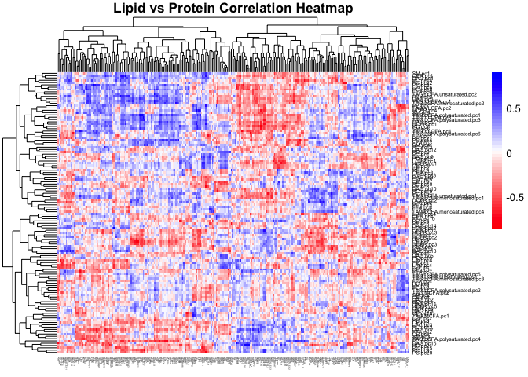

------------------------------------------------------------------------

### Correlation network

Thresholding a correlation matrix gives a co-response network: nodes are
features, edges join strongly correlated pairs (blue = positive, red =
negative).

``` r
# choose a modality correlation matrix and threshold,

choose_corr_here <- metab_corr_mat # change "metab" to one of "cyto", "lipid", or "prot"

threshold       <- 0.70
adjacency_matrix <- ifelse(abs(choose_corr_here) >= threshold, choose_corr_here, 0)
diag(adjacency_matrix) <- 0

g <- graph_from_adjacency_matrix(
  adjacency_matrix,
  mode     = "undirected",
  weighted = TRUE,
  diag     = FALSE
)

plot(
  g,
  vertex.size  = 2,
  vertex.label = NA,
  edge.width   = abs(E(g)$weight) * 2,
  edge.color   = ifelse(E(g)$weight > 0, "steelblue", "tomato"),
  layout       = layout_with_fr(g, weights = abs(E(g)$weight))
)
```

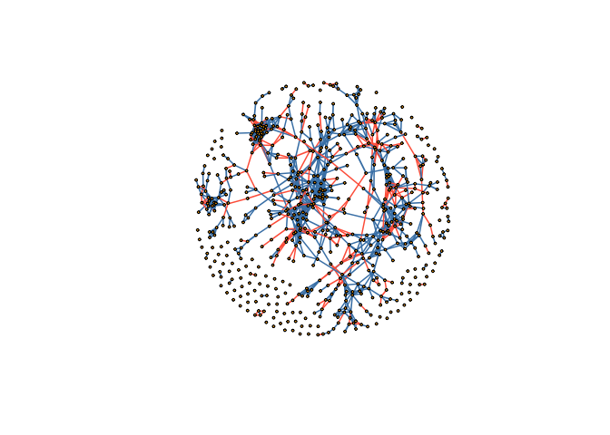
